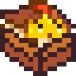

**StardewXnbHack** is a one-way XNB unpacker for Stardew Valley. It supports every Stardew Valley
asset type, is very easy to update for game changes, and is quick at unpacking many files at once.

## Usage
To install it:

1. Install [Stardew Valley](https://www.stardewvalley.net/) and [SMAPI](https://smapi.io/).
2. From the [releases page](https://github.com/Pathoschild/StardewXnbHack/releases), download the
   `StardewXnbHack *.zip` file for your operating system under 'assets'.
3. Unzip it into [your Stardew Valley folder](https://stardewvalleywiki.com/Modding:Game_folder),
   so `StardewXnbHack.exe` (Windows) or `StardewXnbHack` (Linux/macOS) is in the same folder as
   `Stardew Valley.dll`.

To unpack the entire `Content` folder into `Content (unpacked)`, just double-click on
`StardewXnbHack.exe` (Windows) or `StardewXnbHack` (Linux/macOS).

## FAQs
### How does this compare to other XNB unpackers?
StardewXnbHack reads files through a temporary game instance, unlike other unpackers which read
them directly. That lets it support custom Stardew Valley formats, but it can't repack files (which
is [rarely needed anyway](https://stardewvalleywiki.com/Modding:Content_Patcher)) or support other
games.

The main differences at a glance:

&nbsp;                | StardewXnbHack | [xnbcli](https://github.com/LeonBlade/xnbcli/) | [XNBExtract](https://community.playstarbound.com/threads/110976)
--------------------- | ---------------- | ------ | -----------
Supported asset types | ✓ images ✓ maps ✓ dictionary data ✓ font texture ✓ font XML data ✓ structured data | ✓ images ✓ maps ✓ dictionary data ✓ font textures ✓ font XML data ❑ structured data | ✓ images ✓ maps ✓ dictionary data ✓ font textures ❑ font XML data ❑ structured data
Export formats | ✓ `.png` for images ✓ `.tmx` for maps ✓ `.json` for data ([CP](https://stardewvalleywiki.com/Modding:Content_Patcher)-compatible) | ✓ `.png` for images ✓ `.tbin` for maps¹ ❑ `.json` for data (custom format) | ✓ `.png` for images ✓ `.tbin` for maps¹ ❑ `.yaml` for data
Supported platforms | ✓ Windows ✓ Linux ✓ Mac | ✓ Windows ✓ Linux ✓ Mac | ✓ Windows ❑ Linux ❑ Mac
Supported operations | ✓ unpack ❑ pack | ✓ unpack ✓ pack  (uncompressed) | ✓ unpack ✓ pack
Maintainable | ✓ easy to update | ❑ complex | ❑ complex, closed-source
Sample unpack time (full `Content` folder) | ≈0m 43s | ≈6m 5s | ≈2m 20s
License | MIT | GPL | n/a

¹ `.tmx` is the [preferred map format](https://stardewvalleywiki.com/Modding:Maps#Map_formats), but you can open the `.tbin` file in Tiled and export it as `.tmx`.

## For StardewXnbHack developers
This section explains how to edit or compile StardewXnbHack from the source code. Most users should
[use the release version](#usage) instead.

### Compile from source
1. Install [Stardew Valley](https://www.stardewvalley.net/) and [SMAPI](https://smapi.io/).
2. Open the `.sln` solution file in [Visual Studio](https://visualstudio.microsoft.com/vs/).
3. Click _Build > Build Solution_. (If it doesn't find the Stardew Valley folder automatically, see
   [_custom game path_ in the mod build package readme](https://smapi.io/package/custom-game-path).)

### Debug a local build
Just launch the project via _Debug > Start Debugging_. It will run from your `bin` folder, but
should auto-detect your game folder and unpack its `Content` folder.

### Prepare a compiled release
To prepare a crossplatform SMAPI release:

1. Update the [semantic version](https://semver.org) in `StardewXnbHack.csproj`.
2. Run the `build-scripts/prepare-release-packages.sh` on Linux or macOS.  
   _See the [equivalent documentation for SMAPI](https://github.com/Pathoschild/SMAPI/blob/develop/docs/technical/smapi.md#preparing-a-release)
   for the first-time setup (including using WSL on Windows)._
3. Release the zip files created in the root `bin` folder.

## See also
* [Release notes](release-notes.md)
